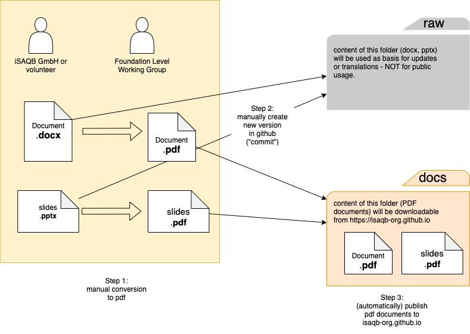

# examination-foundation
Contains several documents that provide information about the examination of the iSAQB foundation level.
 

## Updating documents

1. commit the new version into the "raw" directory (docx and/or pptx)
2. convert to PDF and commit the PDF-file into "docs" directory

## Create new translation

Please care for the filenames. The 2-letter-abbreviation ([Alpha-2 codes](https://www.iban.com/country-codes)) of the language shall be appended to the filename(s).

- en: English
- de: German
- es: Spanisn
- fr: French

1. create files with appropriate names and commit these into the appropriate sub-directory of the "raw" directory
2. convert to pdf and store them in the appropriate sub-directory of the "docs" directory
